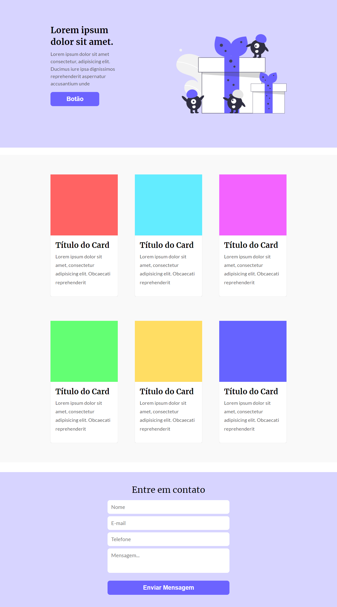

# Desafio (Codelândia 3 - One Page)
Esse projeto foi desenvolvido em colaboração com a comunidade codelândia (um servidor do discord) , na qual são disponibilizados diversos layouts prontos no figma para serem desenvolvido do jeito que você quiser para fins de estudo.

>## Link do discord : 
https://discord.gg/wNCWTVuxyz
>## Link do figma com todos desafios: 
https://www.figma.com/file/Yb9IBH56g7T1hdIyZ3BMNO/Desafios---Codel%C3%A2ndia?node-id=0%3A1

# Aprendizado:
Masterizando ainda mais o conceito mobileFirst e flexivel para todos os tamanhos de tela, e indo mais a fundo com o grid layout.

# Tecnologias Usadas:
- HTML
- CSS 
- Git e Github

>## Link para visualização do projeto
https://codelandia-desafio3-onepage.netlify.app/

# Imagem do projeto (DESKTOP).

